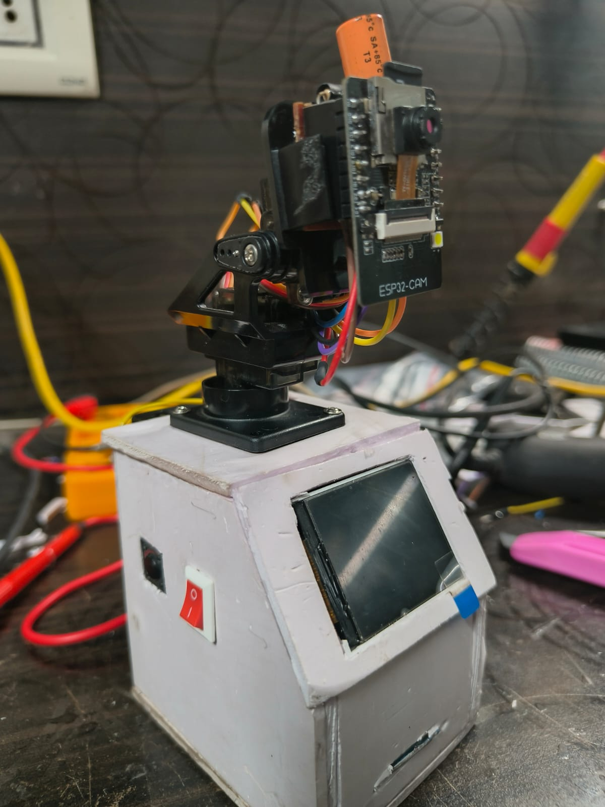
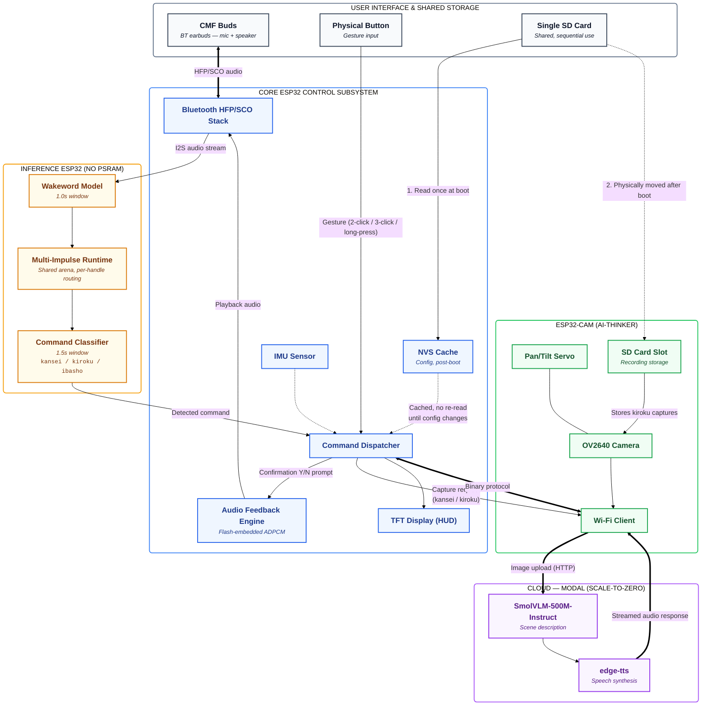
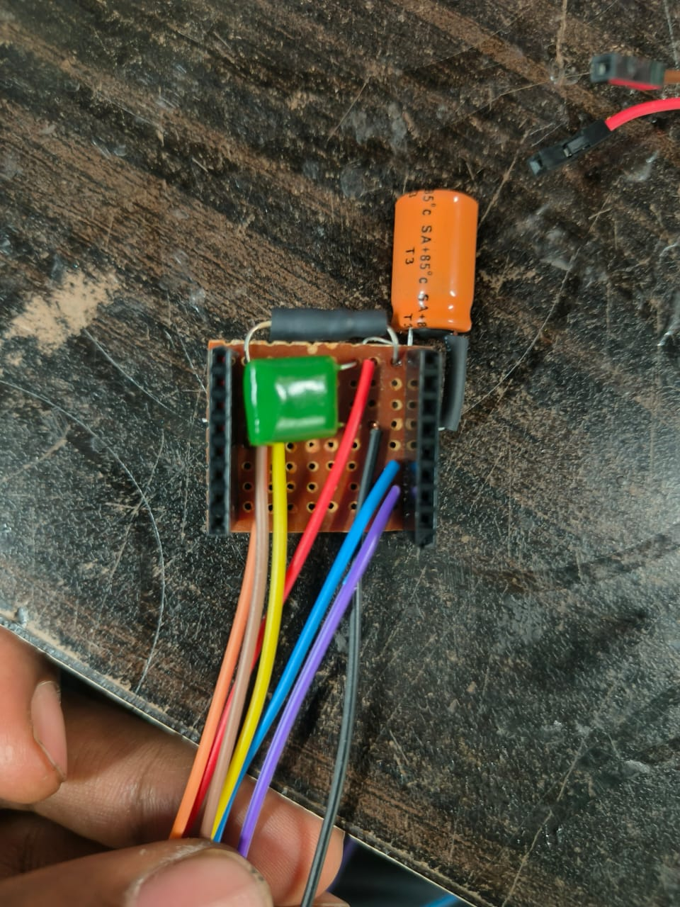
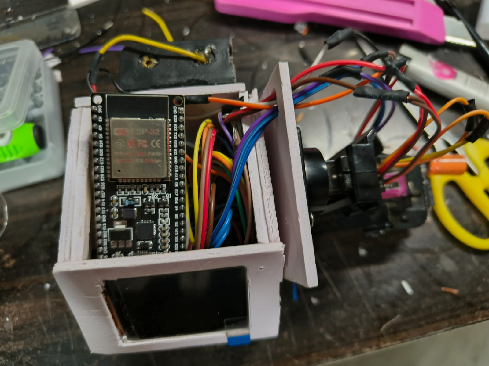
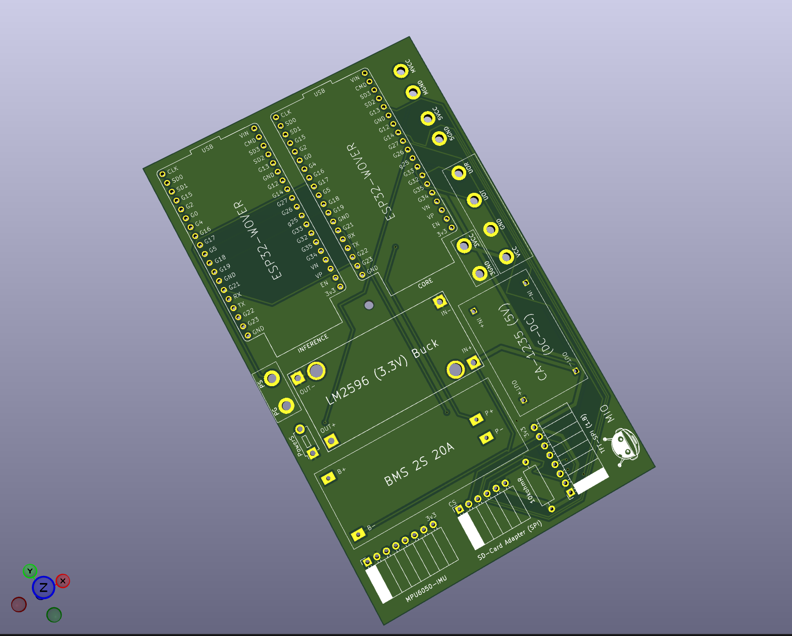
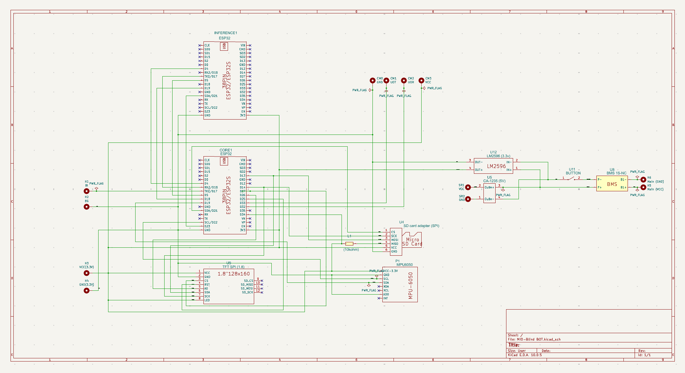
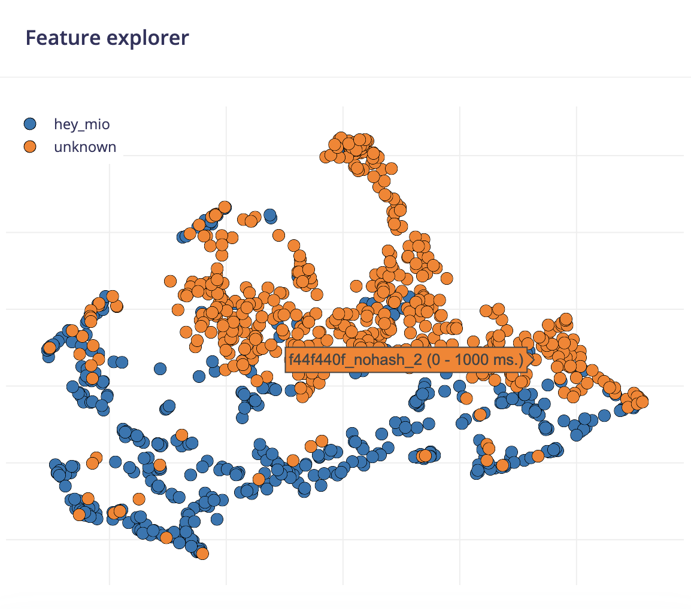
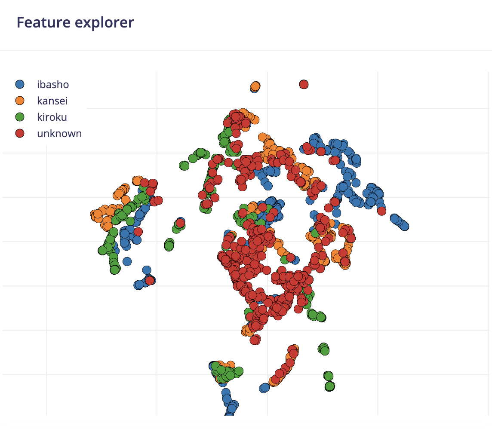
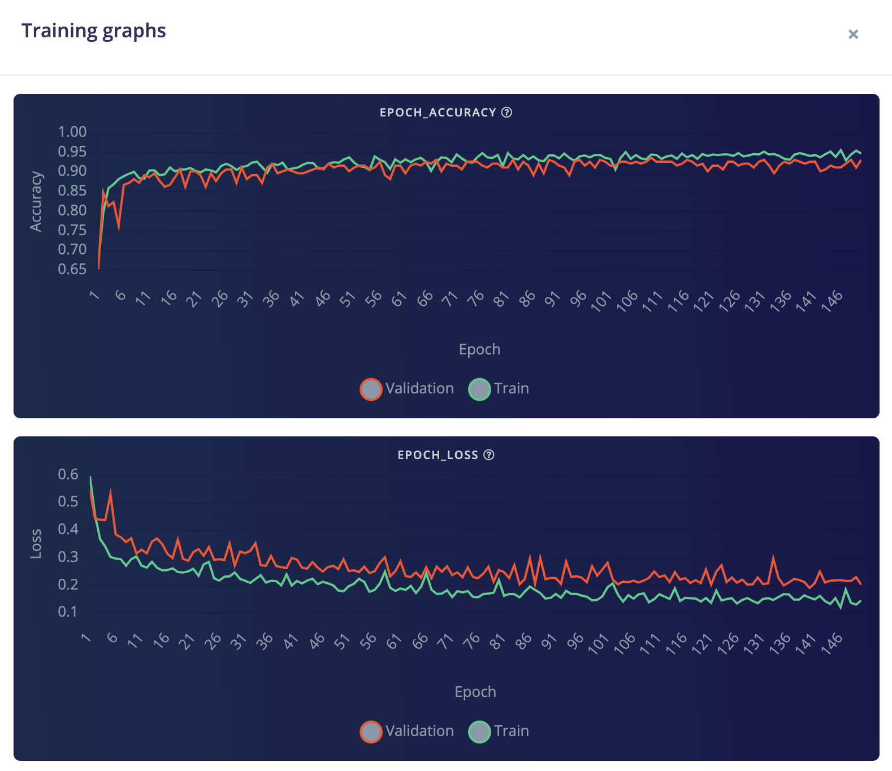
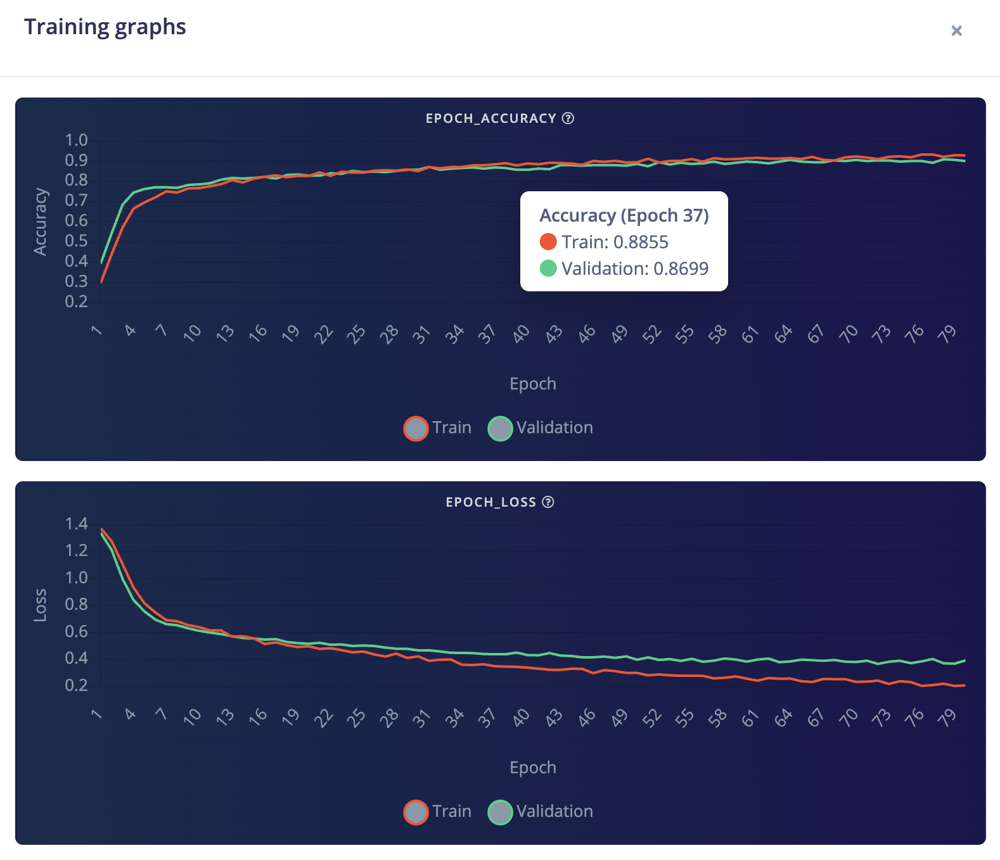

<div align="center">


# MIO

### Wearable, wireless, and voice-first — assistive perception built from the ground up.

[]()
[]()
[]()
[]()
[]()

<br/>

`C/C++` &nbsp;·&nbsp; `Python` &nbsp;·&nbsp; `FreeRTOS` &nbsp;·&nbsp; `ESP-IDF` &nbsp;·&nbsp; `Edge Impulse` &nbsp;·&nbsp; `Bluetooth HFP/SCO` &nbsp;·&nbsp; `KiCad` &nbsp;·&nbsp; `HuggingFace`

</div>


---

## Table of Contents

- [About](#about)
- [Research Foundation](#research-foundation)
- [Core Commands](#core-commands)
- [System Architecture](#system-architecture)
- [Hardware](#hardware)
- [Machine Learning / Edge Impulse](#machine-learning--edge-impulse)
- [Firmware & Toolchain](#firmware--toolchain)
- [Bluetooth Audio Pipeline](#bluetooth-audio-pipeline)
- [SD Card](#sd-card)
- [Cloud Backend (kansei)](#cloud-backend-kansei)
- [Using MIO Firmware in Your Own Projects](#using-mio-firmware-in-your-own-projects)
- [Engineering Challenges](#engineering-challenges)
- [Known Issues / Active Investigation](#known-issues--active-investigation)
- [Repository Structure](#repository-structure)
- [Getting Started](#getting-started)
- [Roadmap](#roadmap)
- [Related Repositories](#related-repositories)
- [License](#license)
- [Acknowledgments](#acknowledgments)

---

## About

MIO is a wearable assistive device that gives blind and low-vision users hands-free access to their surroundings through voice commands and spoken feedback delivered over Bluetooth earbuds. The device requires no screen interaction and no manual input beyond a single physical button used for gesture-based confirmation.

The project started from an earlier concept — a shoulder-mounted "visual translator" bot that would interpret a user's surroundings and relay information through Bluetooth earbuds. That original idea (captured in the project's early planning notes) explored two operating phases: a stationary "commander" mode and a motion-aware navigation mode with obstacle detection. MIO V1 is the first realized implementation of that idea, narrowed in scope to a reliable, wearable, three-command system built around a custom three-board ESP32 architecture.

### V1 Scope & Goals

V1 was deliberately scoped around proving out two things rather than chasing full feature completeness:

1. **Wireless communication as the backbone of the system** — Bluetooth HFP/SCO for continuous mic/speaker access to the earbuds, and Wi-Fi for the camera board's cloud round-trip, coordinated across three independent boards with no wired user interface at all.
2. **User self-customization** — a configuration model that lets a user set up their own device (network credentials, preferences, calibration) through a single SD card, without needing to reflash firmware.

Feature completeness for every command (notably `ibasho`) is intentionally secondary to getting this wireless, user-configurable foundation working reliably — that foundation is what the rest of MIO's features are built on.

This is a **solo hardware, firmware, and cloud project** — designed, built, and debugged end-to-end by one person.

> 📁 **To see MIO working**, check the [`docs/assets/demo`](./docs/assets/demo) folder for build photos, wiring shots, and a demo video/GIF of the device in use.

<p align="center" style="display: flex; justify-content: center; gap: 10px;">
  
  
</p>

---

## Research Foundation

MIO's command design is informed by cognitive science research on how humans process visual scenes and situational information, rather than being an arbitrary feature list.

- **Gist of the Scene — Aude Oliva.** Oliva's research on rapid scene perception shows that humans extract a holistic "gist" of a scene — its category, layout, and broad content — within a few hundred milliseconds, well before detailed object-by-object recognition occurs. This principle directly shapes `kansei`: rather than producing an exhaustive list of detected objects, the command is designed to return a fast, holistic scene summary that mirrors how sighted perception actually works.

- **Situation Awareness Theory — Mica R. Endsley (2000), *Theoretical Underpinnings of Situation Awareness: A Critical Review*.** Endsley's three-level model of situation awareness — perception of elements, comprehension of their meaning, and projection of future status — informed how MIO separates its commands by the kind of awareness they serve: `kansei` addresses immediate perception and comprehension of the environment, `kiroku` extends awareness across time by recording it, and `ibasho` is intended to address projection/response in an emergency (location and safety awareness for others).

- **Real-world evaluation of AI scene description — Gonzalez, Collins, Bennett & Azenkot (2024), *Investigating Use Cases of AI-Powered Scene Description Applications for Blind and Low Vision People*, CHI '24.** This diary study of blind and low-vision users interacting with AI-powered scene description tools found average satisfaction of 2.76/5 and trust of 2.43/4, with recurring failures such as missing potentially dangerous objects. It grounds `kansei`'s design in a documented, current gap — existing AI scene description tools are useful but not yet reliable or trusted by the people they're meant to serve — rather than treating scene description as a solved problem.
[Link](https://dl.acm.org/doi/10.1145/3613904.3642211#Bib0043)

This section exists to document the reasoning behind the command set, not to claim a formal research contribution — MIO applies these existing frameworks rather than extending them.

---

## Core Commands

| Command | Trigger | Function | Status |
|---|---|---|---|
| **kansei** | 2-click | Auto-levels the camera using IMU tilt data, captures the surroundings, and returns a spoken scene description via a cloud VLM pipeline | ✅ Implemented |
| **kiroku** | 3-click | Panoramic recording of the surroundings via servo-driven camera sweep (180deg)| ✅ Implemented |
| **ibasho** | Long-press | Intended for location/SOS sharing | ⚠️ Gesture and confirmation flow are implemented on-device; **no task logic is currently assigned to this command** — planned for a future update |

All commands are confirmation-gated: after a gesture is detected, MIO plays a spoken Y/N prompt and waits up to 5 seconds for confirmation before dispatching the task, so the device never acts on an accidental button press.

> Note: the SD-card configuration schema (see [SD Card](#sd-card)) already includes SOS contact fields (`SOS1_NAME`/`SOS1_PHONE`, etc.), so the data model for `ibasho` exists on-device — only the send/notify task logic itself is not yet wired up.

### Naming

Each command is named with a Japanese word rather than a generic English verb, chosen because its literal meaning maps directly onto what the command does:

| Command | Japanese | Reading | Meaning |
|---|---|---|---|
| `kansei` | [感性] | kansei | sensibility / sensory perception — also the term behind "Kansei Engineering," the design discipline of translating sensory and emotional response into concrete design |
| `kiroku` | [記録] | kiroku | record / recording |
| `ibasho` | [居場所] | ibasho | one's place / whereabouts — where someone is, or where they belong |

---

## System Architecture

MIO runs across **three ESP32 boards**, each scoped to a single responsibility to avoid resource contention between Bluetooth audio, on-device ML inference, and Wi-Fi camera streaming:

| Board | Role |
|---|---|
| **Core ESP32** | Bluetooth HFP/SCO audio to/from the earbuds, TFT display (HUD), SD card config, IMU, audio feedback, button handling, and command dispatch |
| **Inference ESP32** | Wakeword and voice-command classification (Edge Impulse), fed audio over I2S from the Core board |
| **ESP32-CAM (AI-Thinker)** | Pan/tilt camera control, image capture, and Wi-Fi upload to the cloud `kansei` endpoint |




The Core board pins latency-sensitive audio tasks to Core 1 (I2S feeder and audio feedback, at elevated priority) and keeps all display/SPI work on Core 0, avoiding contention between Bluetooth audio timing and UI rendering.

---

## Hardware

**Core components:**
- 3× ESP32 (Core, Inference, ESP32-CAM AI-Thinker)
- OV2640 camera module with pan/tilt servo mount
- ST7735 TFT display
- IMU
- microSD card slot
- 1× physical push button (gesture input — click-count and long-press detection)
- CMF Buds (Bluetooth earbuds — audio input/output)
- External buck converter for the camera board's 3.3V rail

**Power architecture:** The ESP32-CAM's onboard AMS1117 regulator cannot supply the current spikes generated during Wi-Fi transmission, which caused intermittent resets under load. The confirmed fix is powering the board from an external buck converter feeding the 3.3V pin directly, bypassing the onboard regulator.

### Camera Auto-Leveling (IMU-Based)

When `kansei` is triggered, the Core board reads the current tilt from its IMU and relays that value to the ESP32-CAM, which adjusts the pan/tilt servo to a standard reference position that compensates for it. This means the capture angle stays consistent regardless of how the wearable happens to be angled on the user's body at the moment of the trigger, rather than capturing whatever angle the camera was left at.

<p align="center" style="display: flex; justify-content: center; gap: 10px;">


</p>


### PCB

A custom carrier PCB for the Core board is being developed as a separate project, currently in progress:

<p align="center">


</p>

**[MIO-Blind-Bot-PCB →](https://github.com/GuruManoharGuptaBaratam/MIO-Blind-Bot-PCB)**
*KiCad, 2-layer board*

---

## Machine Learning / Edge Impulse

Getting reliable voice-command recognition running entirely on-device — on an ESP32-WROOM with **no PSRAM** — was one of the most iterated-on parts of this project. It took multiple rounds of retraining, re-deploying, and low-level firmware patching to get two independent models to coexist inside a single memory-constrained target with acceptable accuracy.

### Models

| Model | Purpose | Window | Classes |
|---|---|---|---|
| **Wakeword model** | Continuously listens for the trigger phrase | 1.0s (16,000 samples @ 16kHz) | Wakeword / background |
| **Command model** | Classifies the spoken command after wake | 1.5s (24,000 samples @ 16kHz) | `kansei` / `kiroku` / `ibasho` (+ background) |

### Data & Features

- Training data was **orginally recorded voices** and few **synthetically generated using TTS** across multiple voices, speaking rates, and phrasings, then expanded with **audiomentations** (background noise injection, time-stretch, pitch-shift, gain variation) to approximate real-world acoustic variation.
- Feature extraction uses Edge Impulse's **MFE (Mel-filterbank Energy)** DSP block over 16kHz audio for both models.
- Known limitation: because training data is synthetic, there is a train/inference domain gap against real Bluetooth mSBC-captured audio — this is documented under [Known Issues](#known-issues--active-investigation) and the current plan to close it is retraining on real captured mSBC audio.

<p align="center">
  
  
</p>
</p>
<p align="center">


</p>

### Fitting two models on one ESP32-WROOM (no PSRAM)

Both models are combined into a single **multi-impulse deployment** using Edge Impulse's `generate.py` export, producing one deployable inference library that runs both impulses on the same target. Getting this to run reliably — not just compile — required solving several non-obvious problems:

- **Explicit impulse handles are mandatory.** `run_classifier()` silently falls back to a default impulse if a handle isn't explicitly passed. In a multi-impulse build this doesn't error — it just runs the wrong model, which showed up as flat, "frozen" confidence scores that looked like a data problem but wasn't.
- **Per-model arena sizing.** `EI_IMPULSE_TFLITE_ARENA_ALLOC_FAILED (-6)` errors were not a total-heap problem — they came from arena size mismatches whenever `nn_input_frame_size` changed between model retrains, requiring the arena budget to be re-checked after every re-export.
- **Static buffer collisions between impulses.** The reference continuous-inference implementation uses a single function-local `static` matrix sized on first call. With two impulses of different input frame sizes sharing that path, the second model would read/write out of bounds. This required patching `ei_run_classifier.h` with a per-handle cache array — a patch that has to be reapplied after every Edge Impulse re-export.
- **Ring buffer type selection.** Continuous audio buffering initially used a no-split ring buffer, which hard-asserts on partial reads; switched to a byte-buffer ring type suited to streaming inference audio.

The result of this tuning work is two independently-trained models running concurrently on a single no-PSRAM ESP32, with correct routing between them and stable memory usage — which is a large part of why the wakeword → command → dispatch pipeline can run in real time on such constrained hardware.

### Download

<div align="center">

[-brightgreen?style=for-the-badge)](docs/assets/edge-impulse/combined-model/ei_model.zip)

</div>

---

## Firmware & Toolchain

MIO's firmware spans two ESP-IDF versions by necessity:

| Board(s) | ESP-IDF Version | Reason |
|---|---|---|
| Core, Inference | v6.0.1 | Current stable toolchain |
| ESP32-CAM | v5.4 LTS | v6.0.1 has a PicoLibC regression that causes crashes during full PHY calibration on this board |

Both toolchains are managed through separate shell aliases to keep builds isolated and avoid environment conflicts between boards.

---

## Bluetooth Audio Pipeline

MIO's entire input/output experience runs over a Bluetooth HFP/SCO link to the earbuds:

- **Connection establishment:** The Core board negotiates an HFP link with the earbuds and confirms the actual negotiated audio codec (mSBC or CVSD) from the BCS event, rather than assuming wideband audio is active — some earbuds fall back to CVSD despite advertising mSBC support.
- **Mic capture:** Incoming SCO audio is captured with minimal work in the Bluedroid callback (a bare buffer copy); all resampling and buffering happens downstream in dedicated feeder tasks to avoid stalling the Bluetooth stack.
- **Command audio path:** Captured audio is streamed over I2S from the Core board to the Inference board for wakeword and command classification.
- **Speaker feedback:** Spoken responses and confirmation prompts are played back over the same SCO link using pre-rendered audio clips, with cold-boot and mid-session reconnect handling to keep playback in sync with the Bluetooth clock.

---

## SD Card

MIO uses a **single physical SD card shared sequentially between two boards**, rather than a dedicated card per board — a deliberate constraint-driven design choice rather than an oversight:

1. **Power-on, Core board:** On boot, the Core board reads the user's configuration from the SD card and loads it into memory.
2. **Cached to NVS:** That configuration is then cached into the ESP32's NVS (non-volatile flash storage). From this point on, the Core board relies on the **NVS-cached copy** and does **not** re-read the SD card — the card can be physically removed with no effect on Core's behavior until the configuration is intentionally changed again.
3. **Move the card to the ESP32-CAM slot:** Once configuration is loaded, the same SD card is moved into the ESP32-CAM's card slot, where it is used for **recording and storing** captured photos/`kiroku` panoramic sweeps.

This lets a single low-cost SD card serve both a one-time configuration role and an ongoing storage role, without requiring two separate cards or a persistent SD connection to the Core board.

### User configuration via SD card

The SD card is how a user self-customizes their device without reflashing firmware. On first boot (or after a config reset), the card should contain a configuration file with fields such as:

```jsonc
// config.txt (placeholder schema — confirm against the actual parser before publishing)
BT_MAC= XX:XX:XX:XX
SOS1_NAME=John Doe
SOS1_PHONE=+91xxxxxxx
SOS2_NAME=Jane Doe
SOS2_PHONE=+91xxxxxxx
SOS3_NAME=Care Center
SOS3_PHONE=+91xxxxxxx
WIFI_SSID="your_SSID"
WIFI_PASS="your_password"
```

> ⚠️ This schema is a representative placeholder based on the settings the firmware is known to need (network credentials for the CAM board's Wi-Fi client, voice/audio preferences, and servo calibration). Confirm the exact field names and file format against `core/` config-parsing code before publishing, and update this table/example accordingly.

> Formatting note: SD cards must be FAT32/MBR — a common failure mode is macOS defaulting to exFAT/GPT, which the firmware cannot read.

---

## Cloud Backend (kansei)

The `kansei` command's scene description is generated by a FastAPI inference server (`cloud/app`):

1. The ESP32-CAM captures 4 directional frames — separate views around the user, not a stitched panorama — plus an optional reference photo of the device's owner, and uploads them over Wi-Fi to the `/kansei` endpoint, authenticated with a shared-secret header (`X-MIO-Key`).
2. The vision engine ([`HuggingFaceTB/SmolVLM-500M-Instruct`](https://huggingface.co/HuggingFaceTB/SmolVLM-500M-Instruct)) is prompted with a structured system prompt that mentally merges the 4 frames into one scene and produces a three-paragraph, TTS-ready description: environment context, walkable path/obstacles, then a full inventory of every object and person in view. If a person in the scene matches the reference photo, the description addresses them directly as "you" rather than describing them as a stranger.
3. The description text is synthesized to speech with `edge-tts`, then transcoded to raw PCM16 mono 8kHz with `ffmpeg`.
4. The response is returned as a single binary payload — a 4-byte little-endian length prefix, the UTF-8 description text, then the raw PCM16 audio — so the device can parse both text and audio out of one response without a container format.

**VLM:** SmolVLM-500M-Instruct, run in FP16 on GPU (tested on a T4) with images resized to a 1024px longest edge to control memory and latency.

**Endpoints:** `GET /health` (liveness), `POST /kansei` (scene-description pipeline).

The server is deployed on [Lightning.ai](https://lightning.ai/), chosen for straightforward GPU-backed hosting suited to intermittent, on-demand usage.

---

## Using MIO Firmware in Your Own Projects

MIO's three boards are independent ESP-IDF projects, which makes several of its subsystems reusable outside this specific device:

1. **Pick the subsystem, not the whole device.** The most portable pieces are: the Bluetooth HFP/SCO audio pipeline (Core), the flash-embedded ADPCM audio-feedback system (`DECLARE_CLIP` / `EMBED_FILES`), the multi-impulse Edge Impulse inference wrapper (Inference), and the boot-time SD-config-to-NVS loader.
2. **Match the toolchain to the board you're basing your work on.** Use ESP-IDF v6.0.1 if you're building on the Core/Inference pattern, or v5.4 LTS if you're building on the CAM/camera pattern — mixing them on the wrong board reintroduces the PicoLibC regression this project worked around.
3. **Remap pins for your hardware.** Pin assignments live in each board's config header — update these before wiring your own peripherals; don't assume MIO's pinout matches your board revision.
4. **Bring your own Edge Impulse project(s) if reusing the inference pipeline.** Export your trained impulse(s) from Edge Impulse Studio, and if deploying more than one model, follow the multi-impulse `generate.py` export path rather than a single-impulse export. If you do, apply the per-handle static-matrix patch described in [Machine Learning / Edge Impulse](#machine-learning--edge-impulse) — this is required for any multi-impulse deployment, not just MIO's.
5. **Define your own config schema for the SD-to-NVS loader if reused.** The loader itself is generic (read once at boot, cache to NVS, don't require the card afterward); the fields it parses are project-specific — replace them with whatever your project needs to configure.
6. **Build and test each board in isolation first.** Get Core's audio + display + SD path working stand-alone before wiring in Inference and CAM — this project was debugged subsystem-by-subsystem against real serial logs, and that order made integration bugs much easier to isolate.

---

## Engineering Challenges

Real hardware exposes problems that don't show up in documentation or simulation. Every item below was diagnosed from actual serial logs / hardware behavior, not assumption — most initial theories were wrong before the real root cause was found.

### Hardware

1. **ESP32-CAM Wi-Fi brownouts** — The onboard AMS1117 regulator could not handle Wi-Fi transmit current spikes, causing resets. Fixed with an external buck converter powering the board's 3.3V pin directly.
2. **SD card read reliability** — Missing an internal pull-up on the SD MISO line (GPIO34, which has no internal pull-up on the ESP32) caused intermittent read failures, resolved with a physical 10kΩ pull-up resistor.
3. **Servo pin conflicts with a strapping pin** — The ESP32-CAM's GPIO12 is a strapping pin; driving the servo from it without a pull-down risks boot-mode issues, resolved with a 10kΩ pull-down.
4. **Shared UART between console and inter-board protocol** — GPIO1/3 (UART0) is used by the ESP-IDF console by default, which conflicted with using the same lines for the Core↔CAM binary communication protocol; required remapping before that link could be wired reliably.

### Firmware / Software

5. **SCO audio underruns** — Doing resampling work inside the Bluedroid SCO callback caused both transmit queue overflow and ring buffer drops. Fixed by reducing the callback to a bare buffer copy and moving all processing to dedicated feeder tasks.
6. **HFP sniff mode breaking audio** — Bluetooth sniff mode caused SCO transmit queue overflow independent of the audio profile's power management settings, requiring a patch to the ESP-IDF Bluetooth vendor source and a full rebuild.
7. **Silent codec fallback** — Trusting the "mSBC connected" event name instead of the actual negotiated codec led to audio processed at the wrong sample rate when earbuds silently fell back to CVSD.
8. **UART byte loss at high baud rate** — Rendering to the display over UART at 921600 baud was losing bytes whenever the receive task blocked on SPI draw calls. Fixed with an asynchronous render queue and a dedicated render task.
9. **Cross-board toolchain incompatibility** — A regression in ESP-IDF v6.0.1 made the CAM board's boot-time calibration crash; resolved by building that board on ESP-IDF v5.4 LTS instead of chasing the regression upstream.

### Machine Learning

10. **Frozen inference confidence scores** — Voice commands consistently returned near-identical confidence scores. Root cause was the classifier silently falling back to a default impulse handle instead of the intended model, not an audio or normalization issue as first suspected.
11. **Arena allocation mismatches across model versions** — `EI_IMPULSE_TFLITE_ARENA_ALLOC_FAILED` errors traced back to per-model arena sizing, not overall heap pressure.
12. **Static buffer collisions in multi-impulse deployment** — The default continuous-inference implementation's shared static matrix caused out-of-bounds access when two impulses with different input sizes ran back-to-back; fixed with a per-handle cache patch (see [Machine Learning / Edge Impulse](#machine-learning--edge-impulse)).
13. **Ring buffer assertion crashes** — Using a no-split ring buffer type with partial reads caused hard asserts; switched to a byte-buffer ring type suited to streaming audio.

---

## Known Issues / Active Investigation

- **On-device inference accuracy:** Voice command models perform well when evaluated offline in Edge Impulse Studio but show reduced accuracy on-device. This is under active investigation, with the audio capture/timing pipeline as the current lead suspect. Not yet resolved.
- **Train/inference domain gap:** Models are currently trained on synthetic TTS-generated audio rather than real captured Bluetooth mSBC audio; retraining on real captured audio is the planned permanent fix.
- **ibasho:** SOS contact configuration already exists on-device via the SD card schema, but the send/notify task logic is not implemented yet — see [Core Commands](#core-commands).

---

## Repository Structure

```
MIO-Bind-Bot/
├── core/                     # Core ESP32 firmware
├── inference/                # Inference ESP32 firmware
├── cam/                      # ESP32-CAM firmware
├── cloud/                     # kansei FastAPI inference server
│   └── app/
│       ├── main.py            # FastAPI app — /health, /kansei endpoints
│       ├── tts.py              # edge-tts + ffmpeg → PCM16 8kHz
│       ├── vision.py           # SmolVLM-500M-Instruct vision engine
│       ├── .env.example
│       ├── Dockerfile.txt
│       ├── gitignore.txt
│       ├── requirements.txt
│       └── run.sh
├── docs/
│   ├── assets/
│   │   ├── logo/             # ADD: mio-logo.png
│   │   ├── schematics/       # ADD: wiring diagram / schematic
│   │   ├── photos/           # ADD: build photos, wiring shots
│   │   ├── diagrams/         # ADD: architecture & sequence diagrams
│   │   ├── edge-impulse/     # ADD: data spread, feature explorer
│   │   │   ├── combined_model/    
│   │   └── demo/             # ADD: demo video/GIF of MIO in use
├── LICENSE
└── README.md
```


---

## Getting Started

> Setup instructions are being finalized alongside the V1 release. At minimum, building MIO requires:
> - ESP-IDF v6.0.1 (Core, Inference boards)
> - ESP-IDF v5.4 LTS (ESP32-CAM)
> - An Edge Impulse account with access to the wakeword and command models
> - A Lightning (deployment) account for the `kansei` VLM backend, with `cloud/app/.env.example` filled in (`MIO_SHARED_SECRET`, `MODEL_ID`, `TTS_VOICE`)
> - A microSD card formatted FAT32/MBR for device configuration (2-4GB)
>
> Per-board build/flash steps and `.env.example` details to be added.

---

## Roadmap

MIO V1 is a functional first version, not a finished product. Ongoing work is focused on optimizing reliability, latency, and completeness rather than fixed milestones:

- Implementing task logic for the `ibasho` SOS command
- Resolving the on-device inference accuracy investigation
- Retraining models on real captured mSBC audio to close the train/inference domain gap
- Continued hardware refinement, including finishing the carrier PCB
- General optimization of audio latency, model accuracy, and power efficiency across future iterations

---

## Related Repositories

- **[MIO-Blind-Bot-PCB](https://github.com/GuruManoharGuptaBaratam/MIO-Blind-Bot-PCB)** — custom carrier PCB design for the Core board (KiCad, in development)

---

## Contributing

This is currently a solo project. Issues, suggestions, and pull requests are welcome via GitHub Issues on this repository.

---

## License

TBD

---

## Acknowledgments

- [Edge Impulse - WakeWord](https://studio.edgeimpulse.com/public/1036490/live) for the on-device wakeword ML pipeline
- [Edge Impulse - CmdWord](https://studio.edgeimpulse.com/public/1037438/live) for the on-device commandword ML pipeline
- [Lightning.ai](https://lightning.ai/) for serverless backend hosting
- [HuggingFaceTB/SmolVLM-500M-Instruct](https://huggingface.co/HuggingFaceTB/SmolVLM-500M-Instruct) for scene description
- Aude Oliva's research on rapid scene ("gist") perception
- Mica R. Endsley's situation awareness framework

---

## Author

**Guru Manohar Guptha**
[GitHub](https://github.com/GuruManoharGuptaBaratam) · [LinkedIn](https://www.linkedin.com/in/guru-manohar-gupta/)